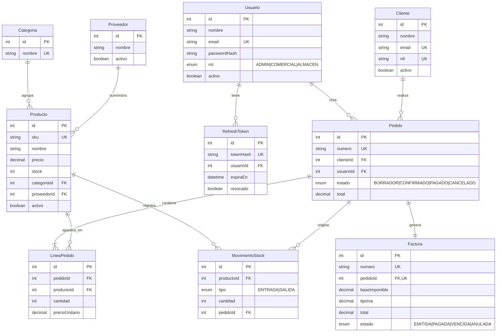

# StockFlow

ERP ligero para la gestión de una tienda / almacén pequeño: catálogo de productos e
inventario, clientes y proveedores, pedidos con varias líneas, facturación con IVA,
usuarios con roles y un panel de métricas del negocio.

Proyecto desarrollado como pieza principal de portfolio para demostrar backend, frontend,
diseño de base de datos relacional y buenas prácticas (arquitectura por capas, validación,
autenticación, tests, Docker y CI).

## Stack

| Capa            | Tecnología                                             |
| --------------- | ------------------------------------------------------ |
| Backend         | Node.js · Express · TypeScript                         |
| ORM             | Prisma                                                 |
| Base de datos   | PostgreSQL                                             |
| Validación      | Zod                                                    |
| Autenticación   | JWT (access token + refresh token)                     |
| Frontend        | React · TypeScript · Tailwind CSS                      |
| Gráficas        | Recharts                                               |
| Tests backend   | Jest · Supertest                                       |
| Contenedores    | Docker · Docker Compose                                |
| CI              | GitHub Actions (lint + tests en cada push)             |
| Facturas PDF    | pdfkit                                                 |

## Estructura del repositorio

```
stockflow/
├── backend/     API REST (Express + Prisma)
└── frontend/    SPA de React (se añade en la Fase 5)
```

Es un **monorepo con dos proyectos npm independientes**, no un workspace. Cada proyecto
tiene su `package.json`, su `tsconfig.json` y su propio ciclo de vida. Para un proyecto de
este tamaño evita la complejidad de configurar npm/pnpm workspaces sin perder la ventaja
de tener todo el historial en un único repositorio.

## Roadmap por fases

- [x] **Fase 0** — Setup inicial (estructura, TypeScript, ESLint + Prettier, README)
- [x] **Fase 1** — Modelado de datos (diagrama ER, schema de Prisma, migraciones, seed)
- [ ] **Fase 2** — Backend: CRUD de Producto, Categoría, Cliente y Proveedor
- [ ] **Fase 3** — Backend: autenticación JWT y autorización por rol
- [ ] **Fase 4** — Backend: pedidos, descuento de stock atómico y facturación
- [ ] **Fase 5** — Frontend: base (layout, rutas protegidas, login)
- [ ] **Fase 6** — Frontend: CRUD conectado con paginación y filtros
- [ ] **Fase 7** — Frontend: dashboard con métricas y gráficas
- [ ] **Fase 8** — PDF de facturas, tests, Docker Compose y CI
- [ ] **Fase 9** — Pulido final, documentación y despliegue

## Modelo de datos

Decisiones de diseño:

- Importes monetarios en `NUMERIC` (`Decimal` en Prisma), nunca en coma flotante.
- Las líneas de pedido y las facturas guardan **snapshots** de precio e IVA: los datos
  históricos no cambian aunque cambie el precio del producto.
- Ciclo de vida del pedido: `BORRADOR → CONFIRMADO → PAGADO` (o `CANCELADO`). El stock se
  descuenta al confirmar, en una transacción atómica (Fase 4).
- Libro de movimientos de stock (`MovimientoStock`) append-only para trazabilidad; el campo
  `Producto.stock` es un valor cacheado.
- Borrado lógico (`activo`) en catálogo; las claves foráneas históricas usan `RESTRICT`.
- `RefreshToken` es una tabla propia (no un campo en `Usuario`): permite logout real y
  sesiones simultáneas en varios dispositivos.

### Diagrama entidad-relación



Schema completo: [`backend/prisma/schema.prisma`](backend/prisma/schema.prisma).

## Puesta en marcha (desarrollo)

Requisitos: Node.js 20+ y Docker (para PostgreSQL).

```bash
# 1. Levantar PostgreSQL
docker compose up -d

# 2. Backend
cd backend
npm install
cp .env.example .env
npm run prisma:migrate   # crea la BD y aplica las migraciones
npm run prisma:seed      # carga datos de prueba
npm run dev
```

La API queda en `http://localhost:3000`. Comprobación rápida: `GET /health`.

`npm run prisma:studio` abre un explorador visual de la base de datos en `http://localhost:5555`.

## Licencia

MIT
